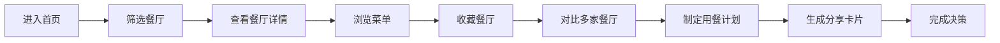

## 1. 产品概述
商圈美食导航应用，帮助用户快速发现周边餐厅、浏览菜品、收藏对比餐厅，并制定用餐计划。
- 面向商圈顾客，解决选择困难、信息分散、用餐规划不便等问题
- 打造一站式美食决策平台，提升用餐体验和决策效率

## 2. 核心 Features

### 2.1 用户角色
| 角色 | 注册方式 | 核心权限 |
|------|----------|----------|
| 游客用户 | 无需注册 | 浏览餐厅、查看菜单、筛选排序 |
| 普通用户 | 本地存储 | 收藏餐厅、对比餐厅、生成用餐计划 |

### 2.2 功能模块
1. **首页**：餐厅列表、多维度筛选、搜索功能
2. **餐厅详情页**：环境展示、招牌菜、排队信息、优惠活动
3. **菜单浏览页**：菜品分类、多维排序、菜品详情
4. **收藏对比页**：收藏管理、多餐厅对比、快速跳转
5. **用餐计划页**：人数选择、时间预约、必选菜品、价格估算、分享卡片

### 2.3 页面详情
| 页面名称 | 模块名称 | 功能描述 |
|----------|----------|----------|
| 首页 | 筛选区域 | 按距离、菜系、人均、营业状态多条件筛选 |
| 首页 | 餐厅列表 | 展示餐厅卡片，包含评分、人均、距离、标签 |
| 首页 | 搜索功能 | 支持餐厅名、菜品名模糊搜索 |
| 餐厅详情 | 环境展示 | 轮播图展示餐厅环境照片 |
| 餐厅详情 | 招牌菜品 | 展示推荐菜品、价格、销量 |
| 餐厅详情 | 排队信息 | 实时显示等待桌数、预计等待时间 |
| 餐厅详情 | 优惠说明 | 展示优惠券、折扣活动、会员福利 |
| 菜单浏览 | 菜品分类 | 按品类切换浏览不同菜品 |
| 菜单浏览 | 排序功能 | 按辣度、口味、适合人数、价格排序 |
| 菜单浏览 | 菜品卡片 | 展示图片、名称、价格、规格标签 |
| 收藏对比 | 收藏列表 | 展示已收藏餐厅，支持取消收藏 |
| 收藏对比 | 对比表格 | 横向对比人均、评分、可订时段等维度 |
| 用餐计划 | 人数时间 | 选择同行人数、到店日期时间 |
| 用餐计划 | 必选菜品 | 添加必点菜品，计算价格 |
| 用餐计划 | 总价估算 | 自动计算菜品总价、服务费预估 |
| 用餐计划 | 分享卡片 | 生成可分享的用餐计划卡片 |

## 3. 核心流程
用户进入首页 → 根据需求筛选餐厅 → 浏览餐厅详情 → 查看菜单挑选菜品 → 收藏心仪餐厅 → 多家餐厅横向对比 → 制定用餐计划（选择人数、时间、必点菜）→ 生成分享卡片 → 完成用餐决策

## 4. 用户界面设计

### 4.1 设计风格
- **主色调**：暖橙色系（#FF6B35），传递美食的温暖与活力
- **辅助色**：深棕（#2C1810）、米白（#F5E6D3）、牛油果绿（#8FB339）
- **按钮风格**：圆角矩形，微立体阴影，悬停时有缩放动效
- **字体**：标题使用 "Playfair Display" 衬线体，正文使用 "Noto Sans SC" 无衬线体
- **布局风格**：卡片式布局，层次分明， generous spacing
- **图标**：lucide-react 线性图标，统一16px/20px尺寸
- **装饰元素**：微妙的食物纹理背景，柔和的渐变阴影

### 4.2 页面设计概览
| 页面名称 | 模块名称 | UI 元素 |
|----------|----------|----------|
| 首页 | 筛选区域 | 标签式筛选器、下拉选择、滑动条、搜索框 |
| 首页 | 餐厅列表 | 横向卡片网格、图片+信息组合、评分星级 |
| 餐厅详情 | 环境展示 | 全屏轮播图、圆点指示器、放大预览 |
| 餐厅详情 | 信息区 | Tab切换、信息网格、状态标签 |
| 菜单浏览 | 分类导航 | 横向滚动分类栏、激活态高亮 |
| 菜单浏览 | 菜品列表 | 瀑布流布局、辣度标识、价格标签 |
| 收藏对比 | 对比表格 | 固定表头、横向滚动、差异高亮 |
| 用餐计划 | 选择器 | 步进器、日期选择器、时间选择器 |
| 用餐计划 | 分享卡片 | 毛玻璃背景、渐变边框、二维码占位 |

### 4.3 响应式设计
- **桌面端优先**：1200px+ 完整布局，4列卡片网格
- **平板适配**：768-1199px，3列网格，筛选区折叠
- **移动端适配**：320-767px，单列布局，底部Tab导航，触控优化
- **触控目标**：所有可点击元素最小44x44px，间距8px以上

### 4.4 动效设计
- **页面切换**：淡入淡出 + 左右滑动过渡，300ms ease-out
- **卡片悬停**：上移4px + 阴影加深，150ms ease-in-out
- **筛选交互**：标签激活时缩放1.05倍，背景色过渡
- **收藏动画**：心形图标填充 + 轻微弹跳效果
- **价格计算**：数字滚动动画，实时更新
- **加载状态**：骨架屏脉冲动画，Skeleton占位
