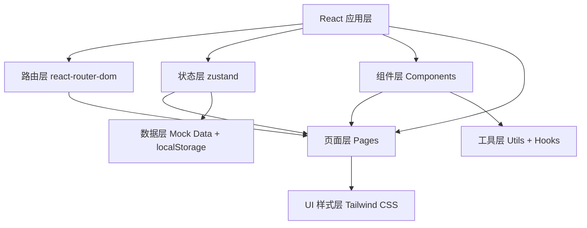
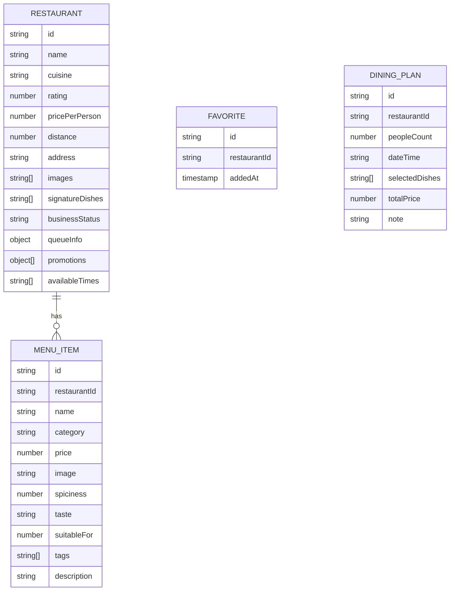

## 1. 架构设计



## 2. 技术描述
- **前端框架**: React@18 + TypeScript + Vite@5
- **路由管理**: react-router-dom@6
- **状态管理**: zustand@4
- **UI 样式**: tailwindcss@3
- **图标库**: lucide-react@0.344
- **数据持久化**: localStorage
- **数据来源**: 前端 Mock 数据
- **后端**: 无（纯前端应用

## 3. 路由定义
| 路由路径 | 页面名称 | 功能说明 |
|-----------|----------|----------|
| `/` | 首页 | 餐厅列表、筛选、搜索 |
| `/restaurant/:id` | 餐厅详情页 | 环境展示、招牌菜、排队信息、优惠 |
| `/restaurant/:id/menu` | 菜单浏览页 | 菜品列表、多维度排序 |
| `/favorites` | 收藏对比页 | 收藏管理、多餐厅对比 |
| `/plan` | 用餐计划页 | 人数时间选择、价格估算、分享卡片 |

## 4. 数据模型

### 4.1 数据模型定义



### 4.2 TypeScript 类型定义

```typescript
// Restaurant 餐厅类型
interface Restaurant {
  id: string;
  name: string;
  cuisine: string;
  rating: number;
  pricePerPerson: number;
  distance: number;
  address: string;
  images: string[];
  signatureDishes: string[];
  businessStatus: 'open' | 'busy' | 'closed';
  queueInfo: {
    waitingTables: number;
    avgWaitTime: number;
  };
  promotions: {
    type: string;
    description: string;
  }[];
  availableTimes: string[];
  tags: string[];
}

// MenuItem 菜品类型
interface MenuItem {
  id: string;
  restaurantId: string;
  name: string;
  category: string;
  price: number;
  image: string;
  spiciness: 0 | 1 | 2 | 3;
  taste: '清淡' | '酸甜' | '麻辣' | '酱香' | '蒜香';
  suitableFor: number;
  tags: string[];
  description: string;
}

// FilterOptions 筛选条件
interface FilterOptions {
  distance: number;
  cuisine: string[];
  priceRange: [number, number];
  businessStatus: string[];
  searchKeyword: string;
}

// SortOptions 排序条件
type SortField = 'spiciness' | 'taste' | 'suitableFor' | 'price';

// DiningPlan 用餐计划
interface DiningPlan {
  id: string;
  restaurantId: string;
  peopleCount: number;
  dateTime: string;
  selectedDishes: string[];
  totalPrice: number;
  note: string;
}
```

## 5. 项目结构

```
src/
├── components/          # 通用组件
│   ├── Layout/        # 布局组件
│   ├── RestaurantCard/  # 餐厅卡片
│   ├── MenuItemCard/    # 菜品卡片
│   ├── FilterBar/       # 筛选组件
│   ├── ImageCarousel/    # 图片轮播
│   ├── SortBar/         # 排序组件
│   ├── CompareTable/    # 对比表格
│   └── ShareCard/       # 分享卡片
├── pages/               # 页面组件
│   ├── Home/           # 首页
│   ├── RestaurantDetail/  # 餐厅详情
│   ├── Menu/           # 菜单浏览
│   ├── Favorites/      # 收藏对比
│   └── DiningPlan/     # 用餐计划
├── store/              # 状态管理
│   ├── useRestaurantStore.ts
│   ├── useFilterStore.ts
│   └── usePlanStore.ts
├── data/               # Mock 数据
│   ├── restaurants.ts
│   └── menuItems.ts
├── hooks/              # 自定义 Hooks
│   ├── useFilter.ts
│   └── useSort.ts
├── utils/              # 工具函数
│   ├── format.ts
│   └── storage.ts
├── types/              # 类型定义
│   └── index.ts
├── App.tsx
├── main.tsx
└── index.css
```

## 6. 状态管理设计

### 6.1 餐厅数据 Store
```typescript
useRestaurantStore
- restaurants: Restaurant[]
- favorites: string[]
- currentRestaurant: Restaurant | null
- toggleFavorite(id)
- getRestaurantById(id)
```

### 6.2 筛选 Store
```typescript
useFilterStore
- filters: FilterOptions
- sortBy: SortField
- setDistance(value)
- setCuisine(list)
- setPriceRange(range)
- setSearchKeyword(keyword)
- setSortBy(field)
```

### 6.3 用餐计划 Store
```typescript
usePlanStore
- currentPlan: DiningPlan
- setRestaurant(id)
- setPeopleCount(count)
- setDateTime(datetime)
- addDish(dishId)
- removeDish(dishId)
- calculateTotal()
- generateShareCard()
```

## 7. 性能优化策略

1. **组件懒加载**: 使用 React.memo 包裹纯展示组件
2. **虚拟滚动**: 长列表使用虚拟滚动技术
3. **图片优化**: 使用 loading="lazy" 懒加载，WebP 格式
4. **状态分离**: 将大组件拆分为小组件，减少重渲染
5. **数据缓存**: localStorage 缓存常用数据
6. **防抖节流**: 搜索、筛选操作添加防抖处理
